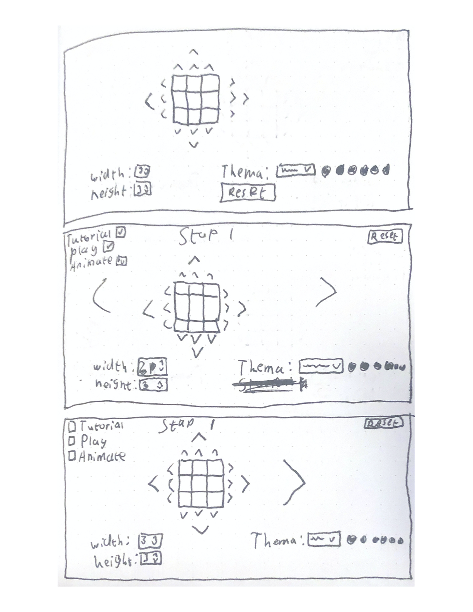
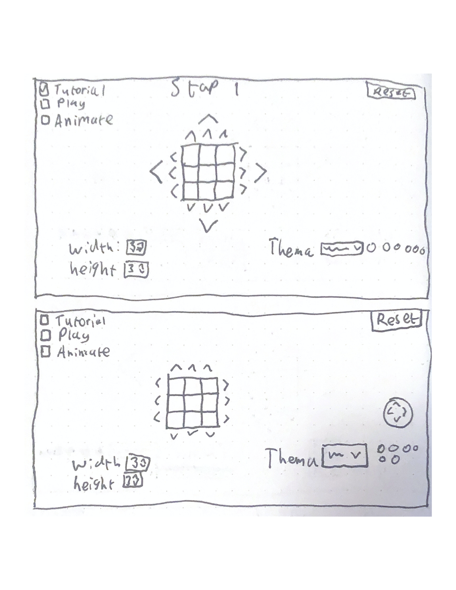

# CSS to the Rescue @cmda-minor-web 2020 - 2021

## Week 1

### Opdracht

- **Gekozen opdracht**: Rubik's Cube
- **Grootste uitdaging**: Alles werkend krijgen met alleen CSS

### Technieken

- Custom Properties
- Transform/Animation
- Calc
- Min/Max & Clamp
- Mixing blend modes
- Linear gradients
- Flexbox
- Grid
- Quantity Queries

### Schetsen

### Breakdownschets
