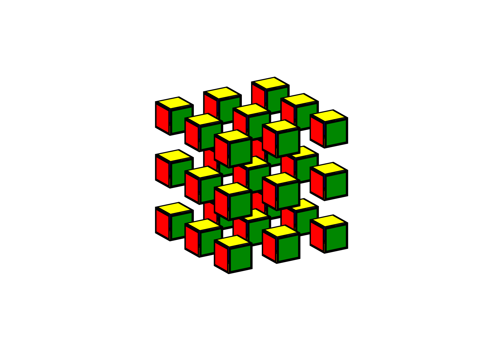
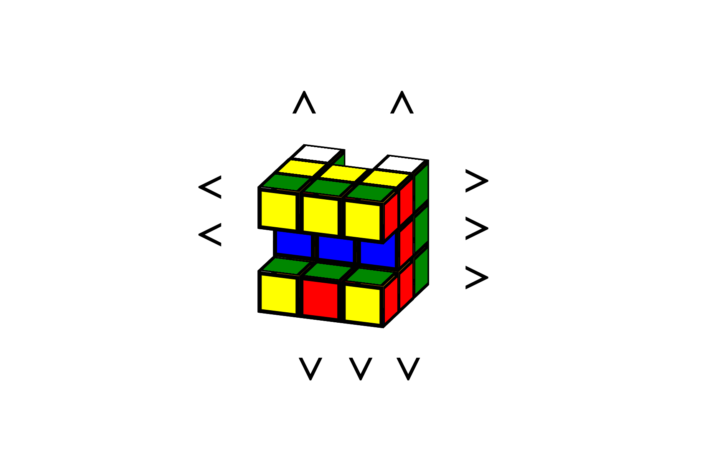
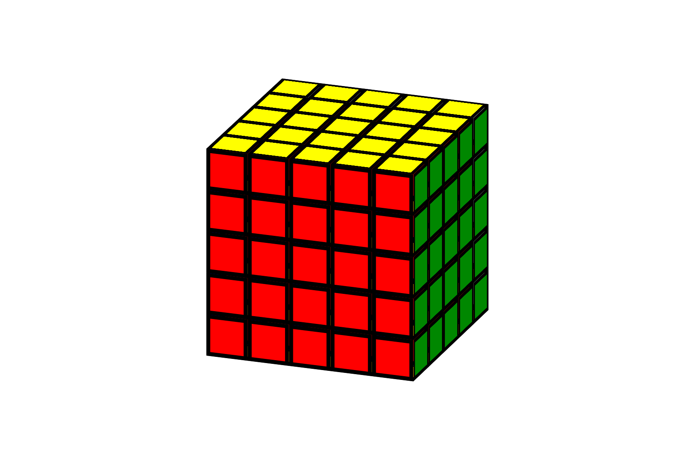
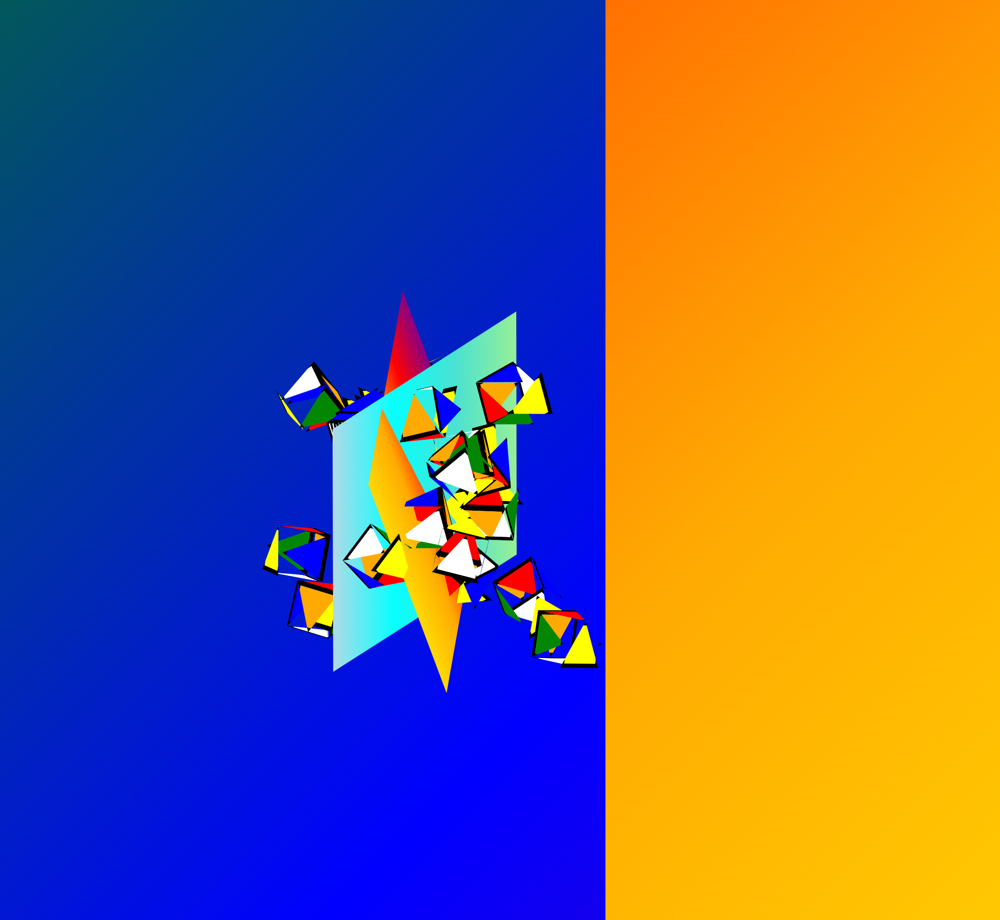

# CSS to the Rescue @cmda-minor-web 2020 - 2021

## Week 4

Week vier was voor mij bijkomen, gezien ik veel heb geleerd over CSS en het me allemaal even moest laten bezinken. Het eindresultaat mag er persoonlijk wel wezen, en ben dus ook erg trots op wat ik neer heb kunnen zetten.

### Het eindresultaat

> Een kubus met een klein magisch trucje in zich.

> Een kubus die zo interactief is als maar kan met css.

> Een screensaver voor echte kubusmensen.

> Een kubus die met je venster meegroeit.

> Een trippende kubus.

### Wat ging goed

- Unieke dingen doen met een CSS kubus.
- Het bouwen van de kubus.
- De vele experimenten met 3D animaties.

### Waar ben ik trots op

- De trippy versie en de screensaver.
- Dat de kubus nog best interactief is geworden, gezien de limitaties.

### Mislukte experimenten

- Totale interactiviteit van de Rubik's Cube.

### Uiteindelijke (CSS) inzichten

- Met alleen HTML en CSS heb je al veel mogelijkheden voor interactie.
- Een Rubik's Cube bouwen met HTML en CSS is best leuk.
- 3D animaties zijn onwijs diepgaand. Ik had altijd het idee dat 3D animaties een second-class citizen waren vergeleken met 2D animaties.
- `perspective` is onwijs krachtig.

### Wat ik hiervan mee ga nemen

- 3D animaties.
- Zoveel mogelijk logische interactie met CSS en HTML zonder JS.
- Leuke easter eggs maken met CSS is top (zoals een screensaver).
- Quantity Queries, 100%.
- Attribute selectors, die gebruikte ik hiervoor té weinig.

## Week 3

Deze week heb ik de kubus volledig herschreven. In plaats van 6 vlakken zijn het nu 27 kleine kubusjes die samen 1 grote kubus vormen. Deze tactiek maakt het besturen van de kubus een heel stuk makkelijker, en dat is te zien ook met de experimenten die ik erop heb losgelaten.

Ik kon helaas de kubus niet verder interactief krijgen zonder JS te introduceren. Er is geen gezonde manier om bij te houden wat de volgorde is van de bewegingen op de kubus, waardoor ik niet selectief kan kiezen welke blokjes moeten bewegen. Misschien dat dat wel op een manier mogelijk is, maar daar kwam ik in ieder geval zelf niet op.

### Wat ging goed

- Ik ben meer out of the box gaan denken en heb gare experimenten op de kubus losgelaten.
- Het schoonmaken, opsplitsen en verdelen van de CSS over de verschillende experimenten.
- Het afmaken van de interactie voor zover dat mogelijk is zonder JS en met mijn kennis.
- Het onder de knie krijgen van `rotate3d`.

### Waar had ik moeite mee

- Het verder pushen van css met betrekking tot de interactivity van de kubus.

### Nieuwe (CSS) inzichten

- Ik heb denk ik de limieten van interactivity met alleen Vanilla CSS wel bereikt denk ik.
- Ik heb een goede party trick ontwikkeld voor als drugs parties weer een ding zijn.
- Ik heb `rotate3d` een heel stuk beter onder de knie gekregen.

### Mislukte plannen

- De kubus correct interactief krijgen.

### Wijzigingen in de plannen

- Even een weekje vakantie nemen, gezien mijn brein echt goed gefrituurd is na al dit experimenteren.

### Nieuwe uitdagingen

- Geen

## Week 2

In week 1 had ik het voor elkaar gekregen om een kubus te maken door 6 vlakken zo tegen elkaar aan te zetten dat het een grote kubus vormt. Deze kubus kon ook makkelijk animeren, dus heb een goed gevoel over het interactief krijgen van de kubus.

Deze week stond in de trend van het werkend krijgen van horizontale rotatie, en een leuke screensaver toevoegen als afleiding van de hel die ik over mezelf afroep.

Ik heb nog met Sanne gesproken over een goede aanpak voor het verder uitbouwen van de kubus, en ik ga deze tactieken wellicht meenemen naar volgende week.

### Wat ging goed

- Het besturen van rijen met geselecteerde radio buttons.
- De labels van de radio buttons op de juiste plek zetten om de kubus goed te kunnen besturen.

### Waar had ik moeite mee

- Het uitvogelen van een goede strategie om de individuele rijen te kunnen besturen.
- Het goed instellen van de `translate-origin`s van de kubusvlakken.
- `rotate3d` onder de knie krijgen. Doet me een beetje denken aan mijn Wiskunde B tijden.

### Nieuwe (CSS) inzichten

- Je kan heel veel doen met geselecteerde radio buttons.
- Screensavers zijn heel leuk om te maken met CSS.

### Mislukte plannen

Tot nu toe geen, maar dat komt zeer waarschijnlijk nog wel.

### Wijzigingen in plannen

- De screensaver nog vetter maken.
- Ik ga de kubus niet om z'n eigen as laten draaien (in een soort camera-control manier). Dat lijkt me te ingewikkeld om uit te werken in CSS.

### Nieuwe uitdagingen

- Naast rijen ook kolommen kunnen laten draaien.
- Iets meer uit de box denken qua wat een CSS-kubus zou kunnen doen.

## Week 1

### Opdracht

- **Gekozen opdracht**: Rubik's Cube
- **Grootste uitdaging**: Alles werkend krijgen met alleen CSS

### Technieken

- Custom Properties
- Transform/Animation
- Calc
- Min/Max & Clamp
- Mixing blend modes
- Linear gradients
- Flexbox
- Grid
- Quantity Queries

### Schetsen

